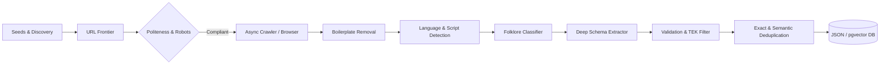

# 🌌 Lokkatha: Web Intelligence & Cultural Knowledge Scraping System

<div align="center">

[](https://www.python.org/)
[](https://react.dev/)
[](https://www.typescriptlang.org/)
[](https://threejs.org/)
[](https://vitejs.dev/)
[](https://docs.pytest.org/)
[](LICENSE)

<p align="center">
  <b>Preserving, Structuring, and Visualizing India's Oral Traditions, Regional Folklore & Traditional Ecological Knowledge (TEK).</b>
</p>

</div>

---

## 📖 Overview

**Lokkatha** is a high-throughput cultural intelligence and automated knowledge preservation platform. Inspired by the discovery and community dynamics of digital story repositories, Lokkatha systematically discovers, extracts, deduplicates, and structures:

- 📜 **Indian Folklore & Folktales** (*Panchatantra, Jataka, Baital Pachisi, Singhasan Battisi, Burhi Aair Sadhu, Thakurmar Jhuli*)
- 🗣️ **Oral Traditions & Regional Ballads** (*Pabuji Ki Phad, Dhola-Maru, Alha-Udal, Baul songs, Grindmill verses*)
- 🌿 **Traditional Ecological Knowledge (TEK)** (*Johad water conservation, Stepwells/Baolis, Khadins, Sacred Groves / Orans, Ethno-botany, Soil lore*)
- 🏛️ **Tribal & Indigenous Narratives** (*Bhil, Gond, Santhal, Bishnoi, Toda, Baiga, Meitei traditions*)
- 🎭 **Cultural Motifs & Archetypes** (*Aarne-Thompson-Uther (ATU) tale types & Thompson Motif Index alignment*)

---

## ☀️ The Lokkatha Solar System Command Center

The Lokkatha Orchestrator frontend visualizes the entire scraping ecosystem as an **interactive, animated 3D Solar System**:

```
                       ✦               ✦
              [WIKIPEDIA]             [ARCHIVE.ORG]
                     \                   /
                      \   ✦  ✦  ✦       /
                       \   Data Flow   /
                        \     ↓       /
                         ☀ ══════════ ☀
                         LOKKATHA CORE
                        (Processing Unit)
                         ☀ ══════════ ☀
                        /     ↑       \
                       /   ✦  ✦  ✦     \
                      /   Data Flow     \
                     /                   \
          [CULTURAL SITES]          [GOV PORTALS]
```

### Key Visual Concepts:
- **Central Sun Core**: Represents the central **Lokkatha AI Processing Core** with animated plasma convection, pulsating coronal flares, dynamic brightness, and particle absorption.
- **Planets as Data Sources**: Each connected source (*Wikipedia, Digital Library, Archive.org, Government Portals, Cultural Sites, Folklore Repositories, Academic Journals, Community Submissions, News & Blogs*) maintains independent **axial rotation** and continuous **orbital revolution**.
- **Luminous Orbital Paths**: Dynamic orbital rings that brighten when data streams are active.
- **Data-Flow Particles**: Real-time glowing data packets travel along curved Bezier trajectories from active source planets into the Sun Core.
- **Full Interactive HUD**: Hover/click raycasting, camera zoom tweening, real-time telemetry gauges (CPU, Memory, Network, Storage), live activity logs, and instant source deployment modal.

---

## 🏗️ Architecture & Pipeline Flow

```text
DISCOVER → NORMALIZE URL → CHECK ROBOTS → DOMAIN POLITENESS → URL FRONTIER
   ↓
ASYNC FETCH (HTTPX / Playwright) → BOILERPLATE REMOVAL → ARTICLE EXTRACTION
   ↓
INDIC SCRIPT / LANGUAGE DETECTION → FOLKLORE CLASSIFICATION → STRUCTURED LLM EXTRACTION
   ↓
SCHEMA VALIDATION → CANONICAL HASHING → DEDUPLICATION (Exact + Semantic) → REPOSITORY STORAGE (JSON / PostgreSQL)
```



---

## 📂 Repository Structure

```text
lokkatha-scraper/
├── app/
│   ├── main.py             # CLI Application Entrypoint
│   ├── config/             # Pydantic-settings, YAML config & Structlog
│   ├── crawler/            # Async HTTP client, Playwright, Frontier, Robots.txt & Rate Limiter
│   ├── discovery/          # Link discovery, search, sitemap parsing
│   ├── extraction/         # Article extractor, boilerplate remover, metadata, Indic language detector
│   ├── folklore/           # Folklore classifier, validator, geography resolver, culture/TEK analyzer
│   ├── deduplication/      # URL normalizer, SHA-256 exact & semantic similarity engines
│   ├── storage/            # JSON repository & PostgreSQL / pgvector models
│   ├── schemas/            # Pydantic v2 domain schemas (Folklore, Source, Crawl)
│   └── utils/              # Hashing, text cleaning, URL canonicalization
├── frontend/               # React 19 + TypeScript + Vite + Three.js Solar System Command Center
│   ├── src/
│   │   ├── components/     # Three.js Canvas, Solar Engine, GlassPanels, Gauges, Modals
│   │   ├── pages/          # Orchestrator, Sources, Tasks, Data Library, Analytics, Settings
│   │   ├── state/          # Centralized store & telemetry stream
│   │   └── types/          # TypeScript domain models
├── prompts/                # Deep LLM prompt templates (Folklore, TEK, ATU motifs, classification)
├── seeds/                  # Curated Indian cultural seeds & URLs
├── tests/                  # Pytest test suite (55 unit & integration tests)
├── data/                   # Structured, raw, cleaned, and rejected storage
├── config.yaml             # Core configuration
└── requirements.txt        # Pinned Python dependencies
```

---

## 🚀 Getting Started

### 1. Backend & CLI Engine Setup

```bash
# Clone the repository
git clone https://github.com/your-username/lokkatha-scraper.git
cd lokkatha-scraper

# Create and activate Python virtual environment
python -m venv .venv
# On Windows
.venv\Scripts\activate
# On Linux / macOS
source .venv/bin/activate

# Install dependencies
pip install -r requirements.txt
```

### 2. Configuration

Copy `.env.example` to `.env` and configure settings:

```bash
cp .env.example .env
```

### 3. Running the Python CLI

```bash
# 1. Crawl a single target URL
python -m app.main crawl https://en.wikipedia.org/wiki/Category:Indian_folklore

# 2. Crawl using seed lists with concurrency and depth
python -m app.main crawl --seeds seeds/websites.txt --max-pages 200 --depth 3

# 3. Analyze extracted structured data
python -m app.main analyze data/structured/

# 4. Export structured knowledge repository to JSON / JSONL
python -m app.main export --format json --output data/export.json
```

### 4. Running the Interactive 3D Frontend

```bash
cd frontend
npm install
npm run dev
```
Open **`http://localhost:5173`** in your browser to enter the 3D Solar System Command Center.

---

## 🧪 Testing & Verification

The test suite thoroughly validates crawler politeness, frontier ordering, Indic language detection, folklore schema validation, and storage repositories:

```bash
# Run complete test suite
pytest -v tests/
```

**Results:**
```text
============================= 55 passed in 7.17s ==============================
```

---

## 📜 Domain Schema Example

```json
{
  "id": "folk-mumal-mahendra",
  "title": "The Legend of Mumal and Mahendra",
  "alternate_titles": ["मूमल-महेन्द्र की अमर प्रेमकथा"],
  "category": "folktale",
  "folklore_type": "love_story",
  "region": ["Rajasthan", "Jaisalmer", "Lodrawa"],
  "language": ["hi", "raj"],
  "story": "Princess Mumal of Lodrawa and Prince Mahendra of Umerkot...",
  "characters": [
    {
      "name": "Mumal",
      "role": "protagonist",
      "species": "human"
    }
  ],
  "environmental_knowledge": [
    {
      "knowledge": "Kak River water catchment & desert oasis conservation",
      "category": "water_management",
      "ecosystem": "desert",
      "confidence": 0.95,
      "evidence_type": "explicit"
    }
  ],
  "source": {
    "url": "https://sahapedia.org/mumal-mahendra",
    "domain": "sahapedia.org"
  },
  "confidence": { "overall": 0.96 }
}
```

---

## 🛡️ Ethics, Politeness & Copyright

- **Respect for Robots.txt**: Complete automated robots compliance and polite backoff.
- **Domain Concurrency & Rate Limiting**: Exponential backoff with per-domain jitter to prevent traffic strain.
- **Cultural Provenance**: Attribution to oral storytellers, tribal elders, researchers, and regional folklore archives.

---

## 📄 License

This project is licensed under the **MIT License** — see the [LICENSE](LICENSE) file for details.
